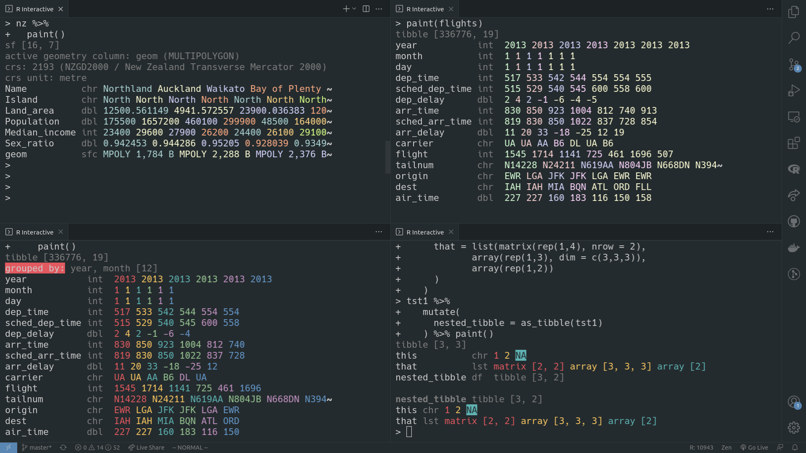

<!-- README.md is generated from README.Rmd. Please edit that file -->

```{r, include = FALSE}
knitr::opts_chunk$set(
  collapse = TRUE,
  comment = "#>",
  fig.path = "man/figures/README-",
  out.width = "100%",
  eval = FALSE
)
options(paint_mask_print = FALSE)
```

```{r, eval = TRUE, echo = FALSE}

```
# paint 

<!-- badges: start -->
[](https://lifecycle.r-lib.org/articles/stages.html#experimental)
<!-- badges: end -->

An artisanally crafted set of print methods for `data.frame` family rectangles:
  * `data.frame`
  * tibble (`tbl_df`)
  * simple features geometry collection (`sf`)
  * `data.table`

## Installation

```r
remotes::install_github("milesmcbain/paint")
```

## Usage

### paint()

Call `paint()` on any compatible `data.frame`. Relevant metadata is printed for each class.

```{r, eval = TRUE}
library(spData)
library(paint)
paint(nz)
```


### Replacing `print()`

```{r, eval = TRUE, echo = FALSE}
detach(name = "package:paint", unload = TRUE, force = TRUE, character.only = TRUE)
```

You can optionally replace the `print()` methods with `paint()` to paint
datafames any time they are output:

```{r, eval = TRUE}
options(
  paint_mask_print = TRUE
)
library(paint)
library(tibble)
coffee_data

```

### Customising

Supported options:

* `paint_palette` the palette to paint row colours with, defaults to
   `rainbow_6`, 6 standard ANSI colours that are supported in most terminals.
* `paint_n_rows` the number of rows to print for each column. Defaults to the
   number of colours in the `paint_palette`, but can be set higher for repeating sequences.
* `paint_max_width` the maximum width of the output. 60 is the default. `{paint}` does not resize
   based on terminal width by design.
* `paint_align_row_head = c("left", "center", "right"). How to align the column
   title and type. Defaults to `"left"`.
* `paint_dark_mode` darken the `paint_palette` using `crayon::blurred` - not
   supported in all terminals.
* `paint_mask_print` mask the print() methods of supported dataframes in the `.Globalenv`? Defaults to `FALSE`.

### Making a custom palette

There are a number of built in palettes - see ?paintpals. Creating your own
palettes is matter of creating a list of `{crayon}` styles. These can be created
from hex colour codes e.g. `#8DD3C7`. A bit easier than it sounds it practice:

```{r, eval = TRUE}
library(viridisLite)
library(crayon)
my_magma <- lapply(viridisLite::magma(6), crayon::make_style)
options(paint_palette = my_magma)
paint(mtcars)
```

Colours are applied to rows in the order they appear in the palette. You can
also use more advanced `{crayon}` styles, but that is beyond the scope of this
document. 

## Design

`{paint}` is a response to long held frustrations with standard print methods.
It tries to be less noisy, harnessing the eye's ability to see colour patterns
to reduce markup characters.  Only the most important information for data
wrangling is highlighted, the pinnacle being the column names, which always
appear down the left and are never
truncated.

Important issues with the data, e.g. sticky `dplyr` groups, or missing values,
are highlighted to draw extra attention.

`{paint}` draws inspiration from [`glimpse()`](https://github.com/r-lib/pillar/blob/master/R/glimpse.R), `str()`, [`{emphatic}`](https://github.com/coolbutuseless/emphatic), and the
[Rainbow CSV](https://github.com/mechatroner/vscode_rainbow_csv) addin for VScode.