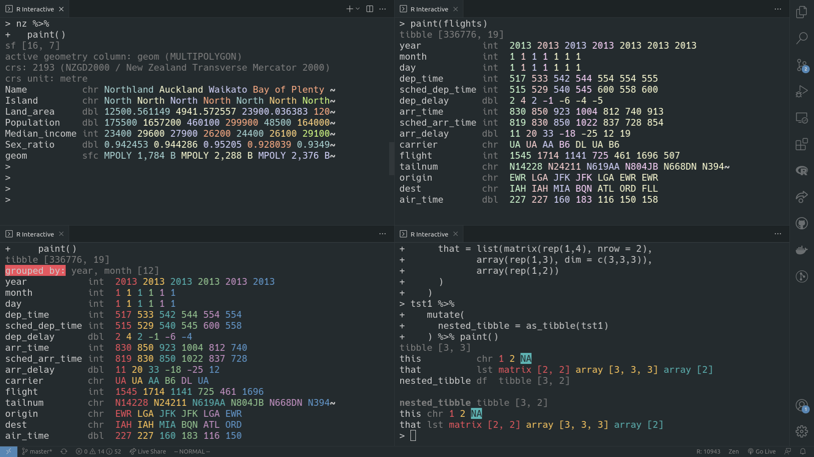

<!-- README.md is generated from README.Rmd. Please edit that file -->



# paint

<!-- badges: start -->

[](https://lifecycle.r-lib.org/articles/stages.html#experimental)
<!-- badges: end -->

An artisanally crafted set of print methods for `data.frame` family
rectangles:

  - `data.frame`
  - tibble (`tbl_df`)
  - simple features geometry collection (`sf`)
  - `data.table`

## Installation

``` r
remotes::install_github("milesmcbain/paint")
```

## Usage

### paint()

Call `paint()` on any compatible `data.frame`. Relevant metadata is
printed for each class.

``` r
library(spData)
library(paint)
paint(nz)
#> sf [16, 7] 
#> active geometry column: geom (MULTIPOLYGON)
#> crs: 2193 (NZGD2000 / New Zealand Transverse Mercator 2000)
#> crs unit: metre 
#> Name          chr Northland Auckland Waikato Bay of Plenty ~
#> Island        chr North North North North North North
#> Land_area     dbl 12500.561149 4941.572557 23900.036383 120~
#> Population    dbl 175500 1657200 460100 299900 48500 164000
#> Median_income int 23400 29600 27900 26200 24400 26100
#> Sex_ratio     dbl 0.942453 0.944286 0.95205 0.928039 0.9349~
#> geom          sfc MPOLY 1,784 B MPOLY 2,288 B MPOLY 2,376 B~
```

### Replacing `print()`

You can optionally replace the `print()` methods with `paint()` to paint
datafames any time they are output:

``` r
options(
  paint_mask_print = TRUE
)
library(paint)
#> {paint} masked print.data.frame
#> {paint} masked print.tbl_df
#> {paint} masked print.sf
library(tibble)
library(sf)
#> Linking to GEOS 3.8.0, GDAL 3.0.4, PROJ 6.3.1
library(spData)
coffee_data
#> tibble [47, 3] 
#> name_long              chr Angola Bolivia Brazil Burundi Ca~
#> coffee_production_2016 int NA 3 3277 37 8 NA
#> coffee_production_2017 int NA 4 2786 38 6 NA
```

### Customising

Supported options:

  - `paint_palette` the palette to paint row colours with, defaults to
    `rainbow_6`, 6 standard ANSI colours that are supported in most
    terminals.
  - `paint_n_rows` the number of rows to print for each column. Defaults
    to the number of colours in the `paint_palette`, but can be set
    higher for repeating sequences.
  - `paint_max_width` the maximum width of the output. 60 is the
    default. `{paint}` does not resize based on terminal width by
    design.
  - `paint_align_row_head = c("left", "center", "right"). How to align
    the column title and type. Defaults to`“left”\`.
  - `paint_dark_mode` darken the `paint_palette` using `crayon::blurred`
    - not supported in all terminals.
  - `paint_mask_print` mask the print() methods of supported dataframes
    in the `.Globalenv`? Defaults to `FALSE`.

### Making a custom palette

There are a number of built in palettes - see ?paintpals. Creating your
own palettes is matter of creating a list of `{crayon}` styles. These
can be created from hex colour codes e.g. `#8DD3C7`. A bit easier than
it sounds it practice:

``` r
library(viridisLite)
library(crayon)
my_magma <- lapply(viridisLite::magma(6), crayon::make_style)
options(paint_palette = my_magma)
paint(mtcars)
#> data.frame [32, 11] 
#> mpg  dbl 21 21 22.8 21.4 18.7 18.1
#> cyl  dbl 6 6 4 6 8 6
#> disp dbl 160 160 108 258 360 225
#> hp   dbl 110 110 93 110 175 105
#> drat dbl 3.9 3.9 3.85 3.08 3.15 2.76
#> wt   dbl 2.62 2.875 2.32 3.215 3.44 3.46
#> qsec dbl 16.46 17.02 18.61 19.44 17.02 20.22
#> vs   dbl 0 0 1 1 0 1
#> am   dbl 1 1 1 0 0 0
#> gear dbl 4 4 4 3 3 3
#> carb dbl 4 4 1 1 2 1
```

Colours are applied to rows in the order they appear in the palette. You
can also use more advanced `{crayon}` styles, but that is beyond the
scope of this document.

## Design

`{paint}` is a response to long held frustrations with standard print
methods. It tries to be less noisy, harnessing the eye’s ability to see
colour patterns to reduce markup characters. Only the most important
information for data wrangling is highlighted, the pinnacle being the
column names, which always appear down the left and are never truncated.

Important issues with the data, e.g. sticky `dplyr` groups, or missing
values, are highlighted to draw extra attention.

`{paint}` draws inspiration from
[`glimpse()`](https://github.com/r-lib/pillar/blob/master/R/glimpse.R),
`str()`, [`{emphatic}`](https://github.com/coolbutuseless/emphatic), and
the [Rainbow CSV](https://github.com/mechatroner/vscode_rainbow_csv)
addin for VScode.
